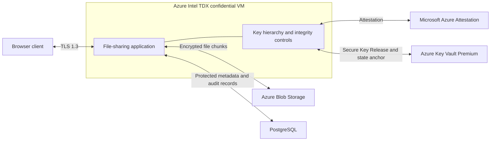

# Secure File Sharing with TEEs

Secure File Sharing with TEEs is a multi-component confidential-computing system for sharing sensitive files on cloud infrastructure outside the data owner's trust boundary. It preserves application-managed upload, download, sharing, revocation, and audit while keeping server-side plaintext and active key material inside Intel TDX-protected memory.

The system combines an application running in an Azure Intel TDX confidential VM with Microsoft Azure Attestation, policy-gated key release from Azure Key Vault, a five-level key hierarchy, protected external storage, anchored database state, an encrypted audit chain, and browser-side signing for security-sensitive user actions.

## Motivation

Encryption at rest and TLS protect files in storage and transit, but conventional cloud applications decrypt data in memory where privileged infrastructure can inspect it. This project closes that data-in-use gap while preserving application-managed access control and file sharing.

## Architecture

The TDX VM is the server-side trust boundary. File encryption, decryption, key wrapping, and access-control decisions occur inside that boundary. Blob Storage and PostgreSQL remain outside it and store encrypted files, wrapped keys, encrypted filenames, authenticated access-control records, and encrypted audit entries.

## System design

| Area | Design |
| --- | --- |
| Data in use | Intel TDX isolates the VM memory and execution state from the host and hypervisor. |
| Key release | Azure Key Vault releases the HSM-backed master key only after Azure Attestation validates the TDX evidence against the release policy. |
| File protection | Files use per-file AES-256-GCM keys and position-bound chunk authentication. |
| Sharing | Each authorized user receives a separately wrapped copy of the file key; sharing and revocation operate on key access rather than re-encrypting file contents. |
| Stored-state integrity | Authenticated encryption protects encrypted objects, and a Key Vault state anchor detects unauthorized changes to security-relevant database state. |
| Accountability | An encrypted hash-chained audit log records application activity; browser keys sign share, revoke, and delete actions. |

See [Security model](docs/security-model.md) for the trust boundary, key hierarchy, and integrity mechanisms.

## End-to-end workflow

1. At startup, the VM obtains attestation evidence and uses Secure Key Release to recover the master key inside the TDX trust domain.
2. Uploads are divided into authenticated chunks and encrypted under a new file key before leaving the VM.
3. Sharing wraps the file key for the recipient. Revocation removes that recipient's wrapped-key and access records without rewriting the file.
4. Downloads recover the requesting user's wrapped key, authenticate and decrypt the stored chunks inside the VM, and return the file over TLS.

## Repository layout

| Path | Contents |
| --- | --- |
| `code/` | Application, browser client, storage adapters, cryptographic controls, and operational utilities |
| `code/tests/` | Local checks and deployment-dependent functional, persistence, and adversarial test harnesses |
| `docs/setup.md` | Azure prerequisites, configuration, deployment, and validation |
| `docs/security-model.md` | Security objectives, trust boundaries, key management, and integrity design |

## Deployment

The system requires an Intel TDX Azure confidential VM, Azure Key Vault Premium, Microsoft Azure Attestation, Azure Blob Storage, and PostgreSQL. Follow [Setup and operation](docs/setup.md) for the required Azure roles, application settings, database schema, startup sequence, and validation commands.

The original deployment was evaluated against live Azure storage and database resources with functional, persistence, adversarial, and performance checks. The repository separates local checks from scripts that require and modify a deployed environment.
